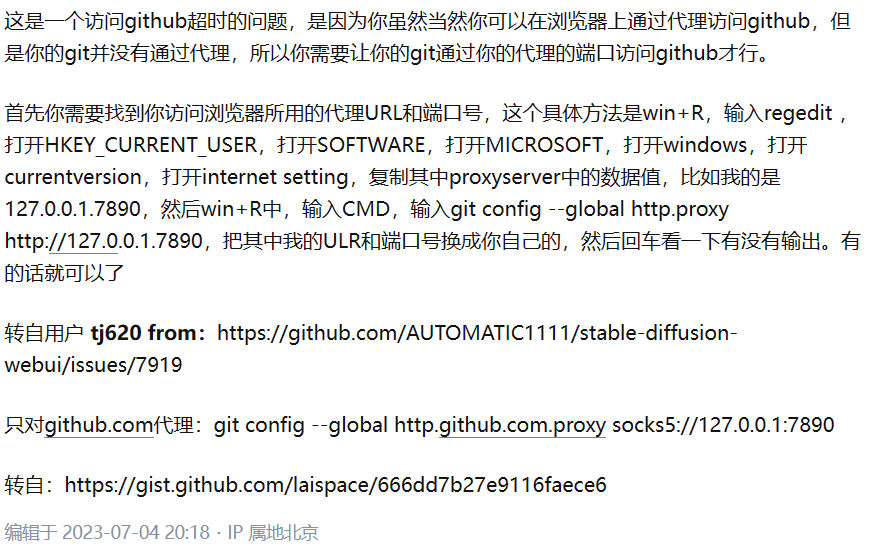

## git连接github失败解决方法

git config --global http.proxy http://127.0.0.1:63368

git config --global https.proxy http://127.0.0.1:63368

最后端口号自己查询

可以使用git config --global --list查看当前代理

使用git config --global --unset http（s）.proxy取消代理
